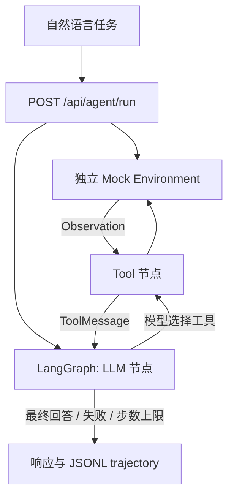
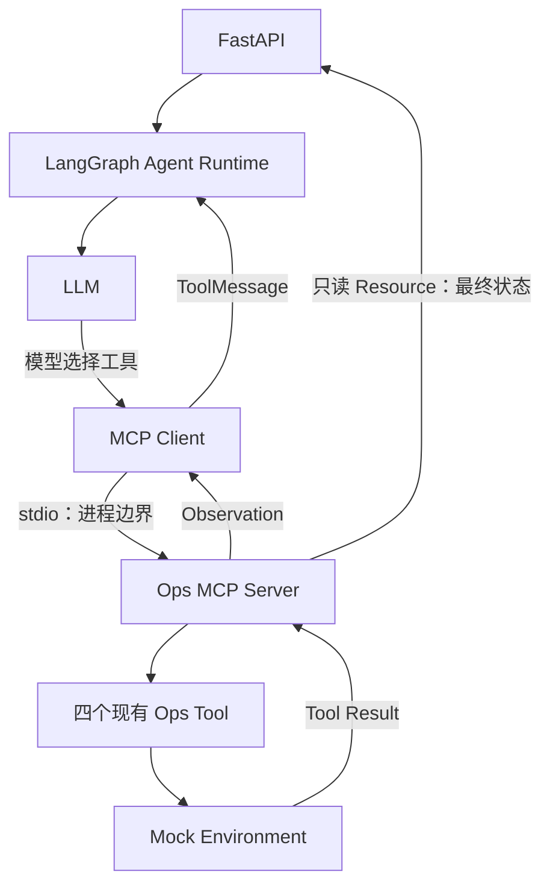

# OpsPilot — Autonomous IT Operations Agent

当前版本：**V1 MCP**。V0 基线为 `9249abc`；V0 说明与实际轨迹保留如下，V1 架构和验收记录见文末。

## 1. 项目解决什么问题

V0 用自然语言诊断模拟服务器 `dev-server` 的 SSH 故障，尝试恢复，并在权限不足时由模型决定是否创建人工工单。仅操作内存中的 Mock Environment，不连接真实服务器，工单也只是模拟记录。

## 2. 为什么是 Agent

模型收到四个工具的 JSON Schema，自主返回 `tool_calls`。Python 按模型给出的名称和参数执行工具，把实际 Observation 作为 `ToolMessage` 回传模型，再由模型决定下一步。没有 SSH 流程表或基于故障状态的工具路由；`scenario` 仅初始化重启权限。

单元测试中的 ScriptedModel 仅验证循环机制，不能证明真实模型会自主恢复。实际 Demo 必须连接支持 Chat Completions 工具调用的模型。

## 3. 架构



文件职责：`environment.py` 管理模拟状态；`tools.py` 暴露四个工具；`agent.py` 管理图循环；`config.py` 读取环境并调用兼容接口；`models.py` 定义输入输出；`trajectory.py` 追加日志；`main.py` 提供两个 API。

默认最多 8 次工具执行（一次响应包含多次调用也逐个计数）。最后一次 Observation 后允许模型生成最终回答，但不再执行新工具。状态为 `RUNNING`、`COMPLETED`、`MAX_STEPS_EXCEEDED`、`FAILED`。

`COMPLETED` 表示模型返回最终回答，不保证修复成功。`success` 根据实际环境计算：目标可达、sshd running、22 端口 open。权限场景创建工单后通常为 `COMPLETED` / `success=false`，这是成功升级处理，不是已恢复 SSH。

## 4. 环境安装

需要 Python 3.11+。本次本地验证使用 Python 3.14.6。

```bash
cd /Users/yaoji/Documents/ChatGPT/it
python3 -m venv .venv
source .venv/bin/activate
pip install -r requirements.txt
# 复现本次验证使用的依赖版本可改用 requirements-lock.txt
```

依赖中 Uvicorn 用于启动 FastAPI，python-dotenv 用于读取本地配置，httpx 用于 FastAPI 离线接口测试。模型 HTTP 请求使用 Python 标准库，无模型厂商 SDK。

## 5. LLM 配置

首次设置时复制 `.env.example` 为 `.env`；已有配置不要覆盖。

```dotenv
LLM_API_KEY=你的密钥
LLM_BASE_URL=你的兼容API地址（含必要的/v1前缀）
LLM_MODEL=支持工具调用的模型名称
```

进程环境变量优先于 `.env`。服务每次模型调用重新读取配置，修改 `.env` 无需重启。客户端向 `LLM_BASE_URL` 后追加 `/chat/completions`，发送标准 `tools`、`tool_choice=auto`、`messages`，不写死厂商或工具顺序。单次网络请求超时为 60 秒，无自动重试。

DeepSeek 官方当前示例可使用 `LLM_BASE_URL=https://api.deepseek.com`、`LLM_MODEL=deepseek-flash`，密钥填入本地 `.env`。参考：[首次调用](https://api-docs.deepseek.com/)、[工具调用](https://api-docs.deepseek.com/guides/tool_calls/)。不同厂商的模型、权限及协议差异需要分别验证；本版不回传隐藏推理字段，因此不支持强制要求回传 reasoning_content 的思考模式。

密钥不写入 trajectory 或 Git。日志仅保存 query、scenario、task_id、工具名称/参数/Observation、最终回答、状态、步数与最终环境/模拟工单，不保存消息历史或隐藏推理字段。

## 6. 启动命令

```bash
source .venv/bin/activate
uvicorn app.main:app --reload
```

仅提供 `GET /health` 和 `POST /api/agent/run`，关闭自动文档路由。

## 7. curl Demo

```bash
curl -sS http://127.0.0.1:8000/health

curl -sS http://127.0.0.1:8000/api/agent/run \
  -H 'Content-Type: application/json' \
  -d '{"message":"dev-server 的 SSH 连不上了，昨天还可以，帮我检查一下并尽量恢复。","scenario":"repairable"}' \
  | python -m json.tool

curl -sS http://127.0.0.1:8000/api/agent/run \
  -H 'Content-Type: application/json' \
  -d '{"message":"dev-server SSH 连不上，帮我处理一下。","scenario":"permission_denied"}' \
  | python -m json.tool
```

每次运行追加至项目的 `data/trajectories.jsonl`，一行一个记录。接口响应包含 `trajectory`，日志中对应字段为 `steps`，另有 `total_steps`。不同请求的环境与工单相互隔离。

## 8. Case A 实际 trajectory

2026-09-10，使用本地配置的 `deepseek-flash`，通过运行中的 FastAPI 实际调用。通过：最终 `sshd=running`、22 端口 open，`COMPLETED / success=true`。

Task ID：`510c6abe-93e4-40af-80eb-c9ff6faac46b`。以下为实际执行记录，不是预设路径：

```json
[
  {
    "step": 1,
    "tool": "check_port",
    "arguments": {
      "host": "dev-server",
      "port": 22
    },
    "observation": {
      "host": "dev-server",
      "port": 22,
      "status": "closed"
    }
  },
  {
    "step": 2,
    "tool": "check_service",
    "arguments": {
      "host": "dev-server",
      "service": "sshd"
    },
    "observation": {
      "host": "dev-server",
      "service": "sshd",
      "status": "stopped"
    }
  },
  {
    "step": 3,
    "tool": "restart_service",
    "arguments": {
      "host": "dev-server",
      "service": "sshd"
    },
    "observation": {
      "status": "success",
      "message": "sshd restarted successfully"
    }
  },
  {
    "step": 4,
    "tool": "check_service",
    "arguments": {
      "host": "dev-server",
      "service": "sshd"
    },
    "observation": {
      "host": "dev-server",
      "service": "sshd",
      "status": "running"
    }
  },
  {
    "step": 5,
    "tool": "check_port",
    "arguments": {
      "host": "dev-server",
      "port": 22
    },
    "observation": {
      "host": "dev-server",
      "port": 22,
      "status": "open"
    }
  }
]
```

完整 API 响应（含最终回答、环境及工单）：[Case A](data/demo-repairable.json)。对应记录已追加至 `data/trajectories.jsonl`。

## 9. Case B 实际 trajectory

2026-09-10，使用本地配置的 `deepseek-flash`，通过运行中的 FastAPI 实际调用。通过：重启被权限拒绝后，模型选择创建工单，没有重复重启。最终 `COMPLETED / success=false`；SSH 仍未恢复，工单只是升级处理。

Task ID：`283ef3d2-4e7e-4ef3-9f91-39383f1fe3f0`。以下为实际执行记录，不是预设路径：

```json
[
  {
    "step": 1,
    "tool": "check_port",
    "arguments": {
      "host": "dev-server",
      "port": 22
    },
    "observation": {
      "host": "dev-server",
      "port": 22,
      "status": "closed"
    }
  },
  {
    "step": 2,
    "tool": "check_service",
    "arguments": {
      "host": "dev-server",
      "service": "sshd"
    },
    "observation": {
      "host": "dev-server",
      "service": "sshd",
      "status": "stopped"
    }
  },
  {
    "step": 3,
    "tool": "restart_service",
    "arguments": {
      "host": "dev-server",
      "service": "sshd"
    },
    "observation": {
      "status": "failed",
      "error": "permission denied"
    }
  },
  {
    "step": 4,
    "tool": "create_ticket",
    "arguments": {
      "title": "dev-server sshd 停止，需人工恢复 SSH 服务",
      "description": "问题：dev-server SSH 无法连接。\n已诊断事实：\n- check_port dev-server:22 => closed（SSH 端口未监听）\n- check_service dev-server sshd => stopped（sshd 服务已停止）\n已尝试操作：\n- restart_service dev-server sshd => failed: permission denied（当前自动化权限不足，无法重启服务）\n剩余工作（需具备 sudo/管理权限的人工处理）：\n1. 登录 dev-server（可通过带外控制台 / 带内管理口 / 云厂商 VNC）确认主机存活与负载。\n2. 以 root 或 sudo 执行 systemctl restart sshd（或 service sshd restart），并检查 sshd 配置（sshd -t）与日志（journalctl -u sshd / /var/log/secure）确认停止原因。\n3. 确认恢复：ssh 22 端口恢复监听，本地与远端均可成功建立 SSH 会话。\n4. 排查根因（是否被误停用、OOM、磁盘满、配置变更），防止再次发生。\n注意：本工单不代表服务已恢复，SSH 恢复需以第 3 步验证结果为准。"
    },
    "observation": {
      "status": "created",
      "ticket_id": "INC-a23a9a268eb7"
    }
  }
]
```

完整 API 响应（含最终回答、环境及工单）：[Case B](data/demo-permission_denied.json)。对应记录已追加至 `data/trajectories.jsonl`。

## 10. 测试命令

```bash
source .venv/bin/activate
pytest -v
```

本次实际执行 `pytest -v`：25 passed，1 条上游弃用警告。离线测试覆盖状态修改、权限失败、请求隔离、工具参数校验、模型自选顺序、Observation 和 tool_call_id 回传、工单升级、预算边界（含批量调用）、模型异常时轨迹保留、JSONL 追加、API 输入校验和兼容接口序列化。Fake 模型只存在于 tests，不会被正式 API 使用。

本地测试出现一条上游 Starlette/AnyIO 弃用警告，不影响执行。JSONL 写入锁仅适用于单进程 Demo，不提供跨进程协调；不要将此 V0 当作生产运维服务。

## 11. V2 Agentic RAG

V2 在 V1 的 MCP 工具发现和轨迹机制上增加了一个模型可选择的 `search_runbook` 工具。运行时不会预先检索；模型根据任务自行决定是否查询本地运维手册，然后把检索 Observation 作为普通 `ToolMessage` 继续推理。索引由显式命令建立，服务启动不会下载模型、重建索引或暗中联网。

本地手册位于 `data/runbooks/`，索引默认写入 `data/qdrant`。首次使用时执行：

```bash
python scripts/index_runbooks.py
python scripts/eval_retrieval.py --index data/qdrant
```

评估脚本读取 `data/eval/retrieval_cases.json`，输出 Recall@1、Recall@3 和 Recall@4，并可用 `--output report.json` 保存完整结果。当前评估结果为 Recall@1 **0.667**、Recall@3 **1.000**、Recall@4 **1.000**。`retrieval_decision_cases.json` 是选择性检索的评估数据，不是运行时规则。

实际 DeepSeek 轨迹保存在以下完整响应文件中：

- Case C（无需检索）：`data/demo-v2-no-rag.json`。模型直接检查端口和服务，未调用 `search_runbook`；最终 `COMPLETED`、`success=false`，环境保持故障状态。
- Case D（检索后验证恢复）：`data/demo-v2-rag-verify.json`。模型选择检索并完成 sshd 重启、服务和 22 端口复验；最终 `COMPLETED`、`success=true`。
- Case E（检索后权限升级）：`data/demo-v2-rag-escalation.json`。模型选择检索，重启因 `permission denied` 失败后创建工单；最终 `COMPLETED`、`success=false`，服务仍未恢复。
- V1 回归 Case A/B：`data/demo-repairable.json`、`data/demo-permission_denied.json`。

所有上述轨迹中的工具调用均带有 `transport=mcp`；响应保留 V1 的状态、环境、工单和轨迹字段。检索服务不可用时会返回安全错误 Observation，由模型自行决定后续处理。

当前限制：检索只使用本地向量索引，不包含 BM25、混合检索、重排、记忆或自动索引；真实运行需要先建立索引并配置支持工具调用的模型。评估集合较小，Recall 仅用于验证当前手册和查询，不代表生产检索质量。

## 12. V2.1 Agent Reliability

V2.1 在 MCP 调用前增加轻量运行时控制：总工具预算 8 次、检索预算 2 次、同一工具签名在同一 `state_revision` 下最多 2 次。重复签名使用小写、去首尾空白并排序 JSON 参数计算；成功的服务重启会递增状态版本，因此重启后的必要验证不会被误判。运行时只限制预算、标记重复和记录元数据，不选择业务工具或改写 Agent 流程。工具描述和系统提示强调最小充分调用、复用 Observation、完成后停止及仅在无法自动恢复时升级。可靠性指标脚本为 `python scripts/eval_reliability.py data/trajectories.jsonl`。

## 12. Future Work

后续仅记录、不实现：V3 Redis Memory；V4 Guardrail + HITL；V5 Benchmark。


## V1 MCP Architecture

V0 在 Agent 进程内调用 Python 工具；V1 使用官方 `mcp==2.2.0` SDK，通过 stdio 跨进程调用独立的 `ops-mcp-server`。Agent 只使用工具名称、描述、Input Schema 与结果，不导入 `app.tools` 或 `app.environment`。Server 复用已有四个工具及状态变更逻辑，不增加业务能力。



每个 API 请求启动自己的 MCP 子进程，并在任务结束后关闭；同一请求的所有调用共享 Server 内的环境，多个请求互不污染。`scenario` 只作为 Server 启动参数初始化环境，不参与工具路由。进程生命周期由官方 SDK 管理。

Client 在每次任务连接时调用 `list_tools()`，把发现的 name/description/input_schema 映射为标准 function tool 定义，交给现有 LangChain Core `convert_to_openai_tool` 序列化；没有复制四套 Schema，也没有引入额外 Adapter 框架。实际发现的工具为 `check_port`、`check_service`、`restart_service`、`create_ticket`，完整 Schema 保存于 [实际 Tool Discovery](data/demo-v1-mcp-tools.json)。

`ops://environment` 是只读 MCP Resource，返回最终环境、是否恢复和模拟工单，供 API 汇报与验收使用；它不是第五个工具，也不会提供给 LLM 选择。

### 启动与 Demo

```bash
source .venv/bin/activate
pip install -r requirements.txt
uvicorn app.main:app --reload
```

无需第二个终端常驻 MCP Server。每次 POST 请求会自动运行等价于以下命令的子进程（使用同一 Python 环境）：

```bash
python -m app.mcp.server --scenario repairable
# 或 --scenario permission_denied
```

该命令使用 stdio 等待 MCP 客户端输入，不监听 HTTP 端口；正式使用只需启动 FastAPI。第 7 节两条 curl 命令保持不变，现已走 MCP。模型配置沿用本地 `.env`。

### 兼容性与错误处理

保留 `status`、`success`、`environment`、`trajectory`、`tickets` 等 V0 字段；每个新步骤增加 `transport: "mcp"`，旧轨迹仍可读取（未标记时默认为 local）。新增字段含义：

| 字段 | 含义 |
| --- | --- |
| agent_status | 与原 status 一致，描述 Agent 执行状态 |
| environment_restored | 与原 success 一致，来自 Server 最终快照 |
| resolution_status | 快照已恢复为 RESOLVED；否则有工单为 ESCALATED；否则 FAILED |
| handled | Agent 为 COMPLETED 且已恢复或已升级处理 |

服务不可用、发现失败、最终快照无法读取会返回 `FAILED` 并保存已有步骤；无法获取快照时 `environment={}` 表示未知，不伪造环境。工具不存在、参数错误、工具调用错误、畸形结果会变成失败 Observation 返回模型。MCP 请求等待上限 5 秒，没有自动重试；原工具调用预算仍为 8 次。

### V1 真实模型验收（2026-09-10）

通过实际 FastAPI HTTP 请求调用 `deepseek-flash`，所有步骤均为 `transport=mcp`。两份完整响应均与 `data/trajectories.jsonl` 对应记录核验一致。

**Case A** — task `0aaa9cd3-52a8-45e8-9331-7e11504019ce`

```text
1. check_service → stopped
2. check_port → closed
3. restart_service → success
4. check_service → running
5. check_port → open
```

结果：`COMPLETED / RESOLVED`，`environment_restored=true`、`handled=true`。[完整响应](data/demo-v1-mcp-repairable.json)。

**Case B** — task `48441fb5-f71b-411c-93b7-e6c127478129`

```text
1. check_service → stopped
2. check_port → closed
3. restart_service → permission denied
4. create_ticket → INC-17ab0ec716e5
```

结果：`COMPLETED / ESCALATED`，`environment_restored=false`、`handled=true`。[完整响应](data/demo-v1-mcp-permission-denied.json)。

Case A 最终 sshd=running、22 端口 open。Case B 只有一次 restart，收到 permission denied 后由模型选择 create_ticket；最终 sshd=stopped、22 端口 closed，已升级人工处理。

### V1 测试与限制

实际运行 `pytest -v`：**40 passed，1 条原有上游弃用警告**。原 25 个测试保留，仅为新增 transport 字段调整一处完整字典断言；新增真实 stdio MCP 测试覆盖 discovery、状态变化、权限、请求隔离、未知工具、参数校验、断线、工具错误、畸形结果、快照失败与 Agent Observation 闭环。测试不依赖 DeepSeek API。

仅验证本地 stdio 与当前 DeepSeek 模型；每次任务启动进程有额外开销。没有实现远程 MCP 部署、共享会话、额外工具或 V2 功能。MCP SDK 的传递依赖包括其他传输和遥测 API 包，本项目未启用对应服务或采集功能。
