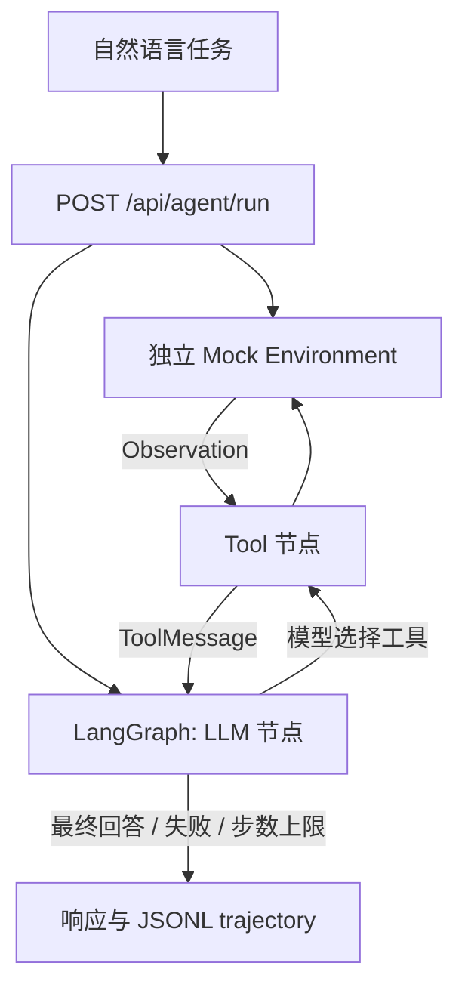

# OpsPilot — Autonomous IT Operations Agent

## 1. 项目解决什么问题

V0 用自然语言诊断模拟服务器 `dev-server` 的 SSH 故障，尝试恢复，并在权限不足时由模型决定是否创建人工工单。仅操作内存中的 Mock Environment，不连接真实服务器，工单也只是模拟记录。

## 2. 为什么是 Agent

模型收到四个工具的 JSON Schema，自主返回 `tool_calls`。Python 按模型给出的名称和参数执行工具，把实际 Observation 作为 `ToolMessage` 回传模型，再由模型决定下一步。没有 SSH 流程表或基于故障状态的工具路由；`scenario` 仅初始化重启权限。

单元测试中的 ScriptedModel 仅验证循环机制，不能证明真实模型会自主恢复。实际 Demo 必须连接支持 Chat Completions 工具调用的模型。

## 3. 架构



文件职责：`environment.py` 管理模拟状态；`tools.py` 暴露四个工具；`agent.py` 管理图循环；`config.py` 读取环境并调用兼容接口；`models.py` 定义输入输出；`trajectory.py` 追加日志；`main.py` 提供两个 API。

默认最多 8 次工具执行（一次响应包含多次调用也逐个计数）。最后一次 Observation 后允许模型生成最终回答，但不再执行新工具。状态为 `RUNNING`、`COMPLETED`、`MAX_STEPS_EXCEEDED`、`FAILED`。

`COMPLETED` 表示模型返回最终回答，不保证修复成功。`success` 根据实际环境计算：目标可达、sshd running、22 端口 open。权限场景创建工单后通常为 `COMPLETED` / `success=false`，这是成功升级处理，不是已恢复 SSH。

## 4. 环境安装

需要 Python 3.11+。本次本地验证使用 Python 3.14.6。

```bash
cd /Users/yaoji/Documents/ChatGPT/it
python3 -m venv .venv
source .venv/bin/activate
pip install -r requirements.txt
# 复现本次验证使用的依赖版本可改用 requirements-lock.txt
```

依赖中 Uvicorn 用于启动 FastAPI，python-dotenv 用于读取本地配置，httpx 用于 FastAPI 离线接口测试。模型 HTTP 请求使用 Python 标准库，无模型厂商 SDK。

## 5. LLM 配置

首次设置时复制 `.env.example` 为 `.env`；已有配置不要覆盖。

```dotenv
LLM_API_KEY=你的密钥
LLM_BASE_URL=你的兼容API地址（含必要的/v1前缀）
LLM_MODEL=支持工具调用的模型名称
```

进程环境变量优先于 `.env`。服务每次模型调用重新读取配置，修改 `.env` 无需重启。客户端向 `LLM_BASE_URL` 后追加 `/chat/completions`，发送标准 `tools`、`tool_choice=auto`、`messages`，不写死厂商或工具顺序。单次网络请求超时为 60 秒，无自动重试。

DeepSeek 官方当前示例可使用 `LLM_BASE_URL=https://api.deepseek.com`、`LLM_MODEL=deepseek-flash`，密钥填入本地 `.env`。参考：[首次调用](https://api-docs.deepseek.com/)、[工具调用](https://api-docs.deepseek.com/guides/tool_calls/)。不同厂商的模型、权限及协议差异需要分别验证；本版不回传隐藏推理字段，因此不支持强制要求回传 reasoning_content 的思考模式。

密钥不写入 trajectory 或 Git。日志仅保存 query、scenario、task_id、工具名称/参数/Observation、最终回答、状态、步数与最终环境/模拟工单，不保存消息历史或隐藏推理字段。

## 6. 启动命令

```bash
source .venv/bin/activate
uvicorn app.main:app --reload
```

仅提供 `GET /health` 和 `POST /api/agent/run`，关闭自动文档路由。

## 7. curl Demo

```bash
curl -sS http://127.0.0.1:8000/health

curl -sS http://127.0.0.1:8000/api/agent/run \
  -H 'Content-Type: application/json' \
  -d '{"message":"dev-server 的 SSH 连不上了，昨天还可以，帮我检查一下并尽量恢复。","scenario":"repairable"}' \
  | python -m json.tool

curl -sS http://127.0.0.1:8000/api/agent/run \
  -H 'Content-Type: application/json' \
  -d '{"message":"dev-server SSH 连不上，帮我处理一下。","scenario":"permission_denied"}' \
  | python -m json.tool
```

每次运行追加至项目的 `data/trajectories.jsonl`，一行一个记录。接口响应包含 `trajectory`，日志中对应字段为 `steps`，另有 `total_steps`。不同请求的环境与工单相互隔离。

## 8. Case A 实际 trajectory

2026-09-10，使用本地配置的 `deepseek-flash`，通过运行中的 FastAPI 实际调用。通过：最终 `sshd=running`、22 端口 open，`COMPLETED / success=true`。

Task ID：`510c6abe-93e4-40af-80eb-c9ff6faac46b`。以下为实际执行记录，不是预设路径：

```json
[
  {
    "step": 1,
    "tool": "check_port",
    "arguments": {
      "host": "dev-server",
      "port": 22
    },
    "observation": {
      "host": "dev-server",
      "port": 22,
      "status": "closed"
    }
  },
  {
    "step": 2,
    "tool": "check_service",
    "arguments": {
      "host": "dev-server",
      "service": "sshd"
    },
    "observation": {
      "host": "dev-server",
      "service": "sshd",
      "status": "stopped"
    }
  },
  {
    "step": 3,
    "tool": "restart_service",
    "arguments": {
      "host": "dev-server",
      "service": "sshd"
    },
    "observation": {
      "status": "success",
      "message": "sshd restarted successfully"
    }
  },
  {
    "step": 4,
    "tool": "check_service",
    "arguments": {
      "host": "dev-server",
      "service": "sshd"
    },
    "observation": {
      "host": "dev-server",
      "service": "sshd",
      "status": "running"
    }
  },
  {
    "step": 5,
    "tool": "check_port",
    "arguments": {
      "host": "dev-server",
      "port": 22
    },
    "observation": {
      "host": "dev-server",
      "port": 22,
      "status": "open"
    }
  }
]
```

完整 API 响应（含最终回答、环境及工单）：[Case A](data/demo-repairable.json)。对应记录已追加至 `data/trajectories.jsonl`。

## 9. Case B 实际 trajectory

2026-09-10，使用本地配置的 `deepseek-flash`，通过运行中的 FastAPI 实际调用。通过：重启被权限拒绝后，模型选择创建工单，没有重复重启。最终 `COMPLETED / success=false`；SSH 仍未恢复，工单只是升级处理。

Task ID：`283ef3d2-4e7e-4ef3-9f91-39383f1fe3f0`。以下为实际执行记录，不是预设路径：

```json
[
  {
    "step": 1,
    "tool": "check_port",
    "arguments": {
      "host": "dev-server",
      "port": 22
    },
    "observation": {
      "host": "dev-server",
      "port": 22,
      "status": "closed"
    }
  },
  {
    "step": 2,
    "tool": "check_service",
    "arguments": {
      "host": "dev-server",
      "service": "sshd"
    },
    "observation": {
      "host": "dev-server",
      "service": "sshd",
      "status": "stopped"
    }
  },
  {
    "step": 3,
    "tool": "restart_service",
    "arguments": {
      "host": "dev-server",
      "service": "sshd"
    },
    "observation": {
      "status": "failed",
      "error": "permission denied"
    }
  },
  {
    "step": 4,
    "tool": "create_ticket",
    "arguments": {
      "title": "dev-server sshd 停止，需人工恢复 SSH 服务",
      "description": "问题：dev-server SSH 无法连接。\n已诊断事实：\n- check_port dev-server:22 => closed（SSH 端口未监听）\n- check_service dev-server sshd => stopped（sshd 服务已停止）\n已尝试操作：\n- restart_service dev-server sshd => failed: permission denied（当前自动化权限不足，无法重启服务）\n剩余工作（需具备 sudo/管理权限的人工处理）：\n1. 登录 dev-server（可通过带外控制台 / 带内管理口 / 云厂商 VNC）确认主机存活与负载。\n2. 以 root 或 sudo 执行 systemctl restart sshd（或 service sshd restart），并检查 sshd 配置（sshd -t）与日志（journalctl -u sshd / /var/log/secure）确认停止原因。\n3. 确认恢复：ssh 22 端口恢复监听，本地与远端均可成功建立 SSH 会话。\n4. 排查根因（是否被误停用、OOM、磁盘满、配置变更），防止再次发生。\n注意：本工单不代表服务已恢复，SSH 恢复需以第 3 步验证结果为准。"
    },
    "observation": {
      "status": "created",
      "ticket_id": "INC-a23a9a268eb7"
    }
  }
]
```

完整 API 响应（含最终回答、环境及工单）：[Case B](data/demo-permission_denied.json)。对应记录已追加至 `data/trajectories.jsonl`。

## 10. 测试命令

```bash
source .venv/bin/activate
pytest -v
```

本次实际执行 `pytest -v`：25 passed，1 条上游弃用警告。离线测试覆盖状态修改、权限失败、请求隔离、工具参数校验、模型自选顺序、Observation 和 tool_call_id 回传、工单升级、预算边界（含批量调用）、模型异常时轨迹保留、JSONL 追加、API 输入校验和兼容接口序列化。Fake 模型只存在于 tests，不会被正式 API 使用。

本地测试出现一条上游 Starlette/AnyIO 弃用警告，不影响执行。JSONL 写入锁仅适用于单进程 Demo，不提供跨进程协调；不要将此 V0 当作生产运维服务。

## 11. Future Work

仅记录，不在 V0 实现：V1 MCP；V2 Agentic RAG；V3 Redis Memory；V4 Guardrail + HITL；V5 Benchmark。
