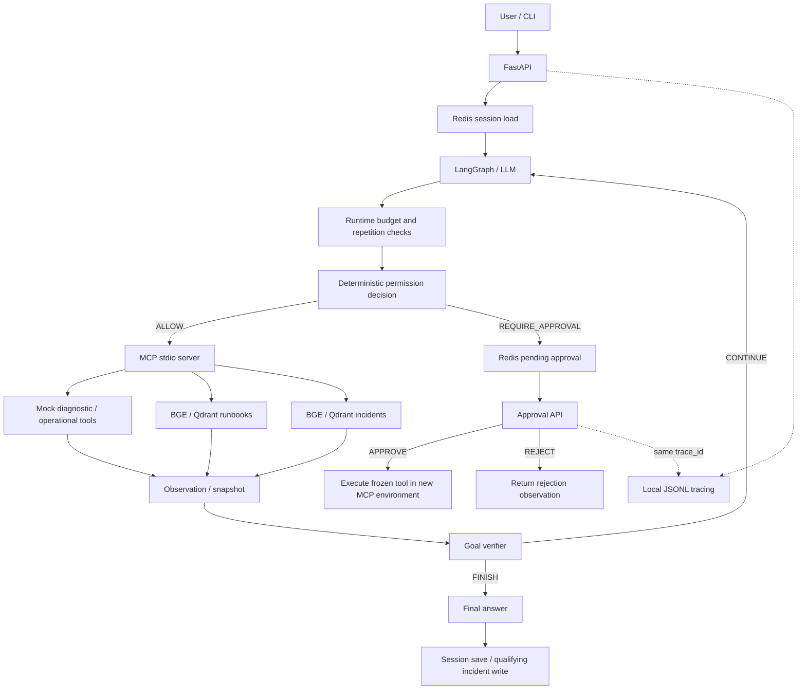

# OpsPilot v1.0

OpsPilot is a tool-using IT operations Agent built with FastAPI, LangGraph and MCP.
An OpenAI-compatible model chooses diagnostics, retrieval and recovery tools from observations.
Runbooks supply operating procedures; Redis supplies session context; incident records supply historical evidence.
Runtime limits, goal verification and human approval constrain execution.
Local traces and a 36-case real-model benchmark make the behavior inspectable.
**This is an interview/developer demo with simulated servers, not a production SSH operator.**

## Why this project

Operations questions combine current facts, procedural knowledge and past experience. OpsPilot exposes each as a tool/context source and lets the model decide what it needs. Python controls permissions and loop termination; it does not prescribe a fixed diagnostic sequence.

## Architecture and execution



The approval endpoint currently executes a frozen tool and reports its snapshot; it does **not** restore the prior LangGraph checkpoint or run a post-approval verifier. The diagram reflects that boundary.

## Context and memory

- **Runbook RAG:** BGE embeddings and the `runbooks` Qdrant collection provide documented procedures when the model requests them.
- **Session memory:** Redis stores bounded messages and entity references. History does not establish current server state.
- **Incident memory:** `opspilot_incidents` stores structured outcomes with source task IDs. Historical retrieval still requires current-state verification; the benchmark exposes failures to do so.
- Compose uses Qdrant server. With `QDRANT_URL` unset, the original exclusive-lock local directories remain available.

## Reliability and human approval

Tool budget, retrieval budget and repeat detection constrain the loop. A structured goal verifier can stop it early. `restart_service` proposals require approval through the API; read-only tools and ticket creation are allowed by current policy. Pending records have Redis TTL, and sequential duplicate approval returns HTTP 409.

The benchmark verifies these specified paths. Approval resolution is not atomic across concurrent requests; the in-memory fallback has no expiry and is not durable across requests. This release requires Redis for the demo and does not claim production authorization or concurrent exactly-once execution.

## Observability

Trajectory records Agent actions and observations. Trace records component spans and timing in `data/traces/traces.jsonl`. Approval requests reuse `trace_id`. Known sensitive argument keys are redacted. Complete prompts or hidden reasoning are not deliberately captured, but tool queries/arguments are currently recorded: there is no implemented content-capture toggle.

Existing Trace limitations remain: some provider calls are missing, trace task IDs may differ from Agent task IDs, retrieval spans cover the MCP boundary, and approval completion does not finalize the root record. The Langfuse adapter is a disabled stub; no working external export is claimed. V6 uses independently measured request timing rather than nested span sums.

## Final Benchmark

36 real-model cases, 42 requests, `deepseek-flash`, one attempt per case; no prompt tuning or retries. Task success measures required structured evidence and a nonempty answer, not an independent semantic answer grade. Recovery intent is evaluated at the approval boundary.

| Metric | V6 result |
|---|---:|
| Task Success Rate | 75.00% |
| Tool Selection Accuracy | 86.11% |
| Tool Argument Accuracy | 94.19% |
| Runbook Recall@3 | 83.33% |
| Incident Recall@3 | 100.00% |
| Context Recall Accuracy | 100.00% |
| Post-resolution Action Rate | 0.00% |
| Unauthorized Execution Rate | 0.00% |
| Dispatch Trace Coverage | 100.00% |
| P50 / P95 completed-request latency | 7.76 / 36.28 s |


Nine deterministic HTTP/MCP/Redis safety cases passed, plus an unavailable-index failure probe. Unauthorized execution, rejected execution and sequential replay duplicates were all zero in those tests. Incident current-state verification was **0%** across the four historical-retrieval requests, a documented failure rather than a hidden result. Dispatch coverage is not complete LLM-call coverage. Latency uses 34 completed requests; 8 pending requests are excluded and missing completed latency count is 0.

[Full report](data/benchmark/results/final-report.md) · [Raw metrics](data/benchmark/results/final-metrics.json) · [Failures](data/benchmark/results/failure-analysis.json) · [Methodology](docs/benchmark.md). Development demos are not benchmark samples.

## Quick start

Requirements: Docker with Compose; outbound access for Python packages, the BGE model and your configured LLM provider. No LLM is hosted inside the containers.

```bash
cp .env.example .env  # first setup only; preserve an existing .env
# Set LLM_API_KEY, LLM_BASE_URL and LLM_MODEL in .env.
docker compose up -d --build
curl http://127.0.0.1:8000/health
curl http://127.0.0.1:8000/ready
make index           # explicit first-time Runbook initialization
make setup           # optional local venv for CLI scripts/tests
make smoke
make demo
```

Indexing is explicit; API startup does not rebuild knowledge. `make index` replaces the Runbook collection, so rerun it only when intentionally updating runbooks. Optional incident reproduction: `python scripts/prepare_benchmark.py --restore-incidents` uses the saved benchmark records through the normal store API. For Compose, supply the benchmark snapshot to the container explicitly if restoring it; it is not baked into the runtime image.

If port 8000 is occupied, set `OPSPILOT_PORT=18000` when invoking Compose and use `make smoke PORT=18000`. Redis and Qdrant are not published on host ports. API is bound to localhost. Volumes persist Redis, Qdrant, runtime traces and model cache. `docker compose down` preserves volumes.

Native development: `make setup`, run Redis, `python scripts/index_runbooks.py`, then `.venv/bin/uvicorn app.main:app --host 127.0.0.1 --port 8000`. Local Qdrant files permit only one owner at a time; use server mode for concurrent access.

## Demo

```bash
.venv/bin/python scripts/demo.py --case direct
.venv/bin/python scripts/demo.py --case rag
.venv/bin/python scripts/demo.py --case memory
.venv/bin/python scripts/demo.py --case hitl
```

CLI prints USER, AGENT TOOL, OBSERVATION, GUARDRAIL, APPROVAL, FINAL and TRACE ID. HITL asks `Approve mock restart? [y/N]`. `--approve` explicitly authorizes the mock action for a noninteractive demo. [Demo guide](docs/demo-guide.md).

## API

`GET /health` returns `{"status":"ok"}` for liveness. `GET /ready` checks Redis and Qdrant without calling the LLM, returning HTTP 200/503 with dependency states. A healthy dependency does not imply the Runbook collection has been indexed.

```bash
curl -X POST http://127.0.0.1:8000/api/agent/run \
  -H 'Content-Type: application/json' \
  -d '{"message":"检查 dev-server 的 22 端口。","scenario":"repairable","session_id":"demo-001"}'

curl -X POST http://127.0.0.1:8000/api/agent/approval \
  -H 'Content-Type: application/json' \
  -d '{"approval_id":"ID_FROM_PENDING_RESPONSE","decision":"APPROVE"}'
```

Run response includes `task_id`, `trace_id`, `session_id`, `status`, `trajectory`, `environment`, and optionally `pending_approval`. Approval decisions are `APPROVE`/`REJECT`; unknown/expired IDs return 404, resolved IDs 409. `/docs` is disabled in the current API. See code for exact Pydantic models.

## Repository

```text
app/agent.py             LangGraph loop
app/mcp/                 stdio client/server and tool boundary
app/rag/                 chunking, BGE, Runbook retrieval
app/memory/              Redis session and Qdrant incident memory
app/guardrails/          deterministic permission policy
app/approval.py          pending approval store
app/observability/       local tracing and disabled export stub
app/storage.py           local/server Qdrant deployment selection
app/readiness.py         dependency checks
data/runbooks/           operational documents
data/benchmark/          frozen V6 cases, attempts, clean traces, metrics
scripts/                 index, demo, smoke, benchmark, release checks
docs/                    architecture, benchmark, interview and resume material
```

## Testing and release verification

```bash
make test
REDIS_TEST_URL=redis://localhost:6379/0 make test
make benchmark  # recomputes reports from saved original runs; no LLM calls
.venv/bin/python scripts/verify_release.py --smoke-url http://127.0.0.1:8000
```

Final local regression: **105 passed, 2 warnings** with the Redis integration enabled.

The release verifier checks pytest, Compose configuration, benchmark artifacts, document metric consistency, and tracked-secret patterns. Docker runtime verification is reported separately in [release verification](docs/release-verification.md). It never silently treats a missing daemon as a runtime pass.

## Limitations and future work

No real SSH execution, production authentication, atomic concurrent approval resolution or durable graph checkpoint resume. Benchmark scale is small and environment-specific. Token usage is unavailable in the current transport. Local tracing is not fully failure-isolated or concurrent-write safe. These are release limitations, not capabilities implied by the packaging. Future work should be driven by a real deployment need; this release adds no V8, new tools, model training or orchestration stack.

[Architecture](docs/architecture.md) · [Interview notes](docs/interview-notes.md) · [Resume](docs/resume.md) · [Development history](docs/archive/version-history.md)
